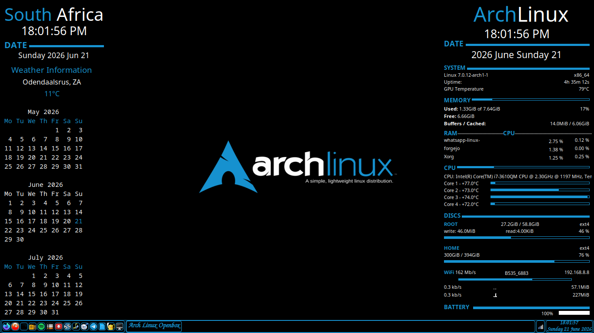

# Openbox Dotfiles

[](https://archlinux.org)
[](https://www.x.org/)
[](https://openbox.org)
[](LICENSE)

<div align="center">
  
</div>

<p align="center">
  <strong>A highly customized, lightweight, and plug-and-play Openbox configuration for Arch Linux.</strong>
</p>

---

## 📖 About Openbox

**Openbox** is a next-generation, extremely fast, lightweight, and highly configurable stacking window manager for the X Window System. Unlike tiling window managers that force windows into a strict grid, Openbox allows windows to overlap and be freely resized, giving you the traditional desktop experience while still offering powerful, keyboard-driven workflows. 

It is renowned for its minimal resource footprint, making it the perfect choice for older hardware, or for users who want to maximize their system's performance for demanding tasks. Openbox is configured entirely through XML files (`rc.xml` for settings and keybinds, `menu.xml` for the desktop menu), providing deep, granular control over every aspect of your desktop environment without the need for external daemons.

## ✨ Features

- **Lightweight & Fast**: Minimal RAM and CPU usage, ensuring your hardware resources are dedicated to your applications.
- **Dual Conky Setup**: Beautifully balanced system monitoring widgets on both the left and right sides of the screen.
- **Auzia-Conky Integration**: Features the stunning, Lua-based `auzia-conky` theme on the left panel with dynamic gauges and a modern aesthetic.
- **Native Keybinds**: Carefully mapped keyboard shortcuts handled natively via `rc.xml` for a seamless, self-contained workflow.
- **Custom Menus**: A cleanly organized right-click desktop menu via `menu.xml`.
- **Pre-configured Wallpapers**: Includes a curated selection of Arch Linux-themed wallpapers.

## 📦 Installation

### Prerequisites
Ensure you have the core packages installed from the official repositories:
```bash
sudo pacman -S openbox xfce4-power-manager tint2 xorg-xinit pcmanfm lxterminal nwg-look

Packages installed with trizen (AUR helper)
conky-lua-nv obconf-qt obmenu-generator openbox-themes flat-remix-gtk
Note: conky-lua-nv is strictly required to get the auzia-conky theme working properly
Clone or download this repository.
Copy the configuration files to your ~/.config/ directory:
cp -r configs/openbox/* ~/.config/openbox/

## 📖 Documentation & Installation

For full installation instructions, keybinds, conky configuration, and theming details, please visit the **Official Documentation Website**.

## 📸 Screenshots


